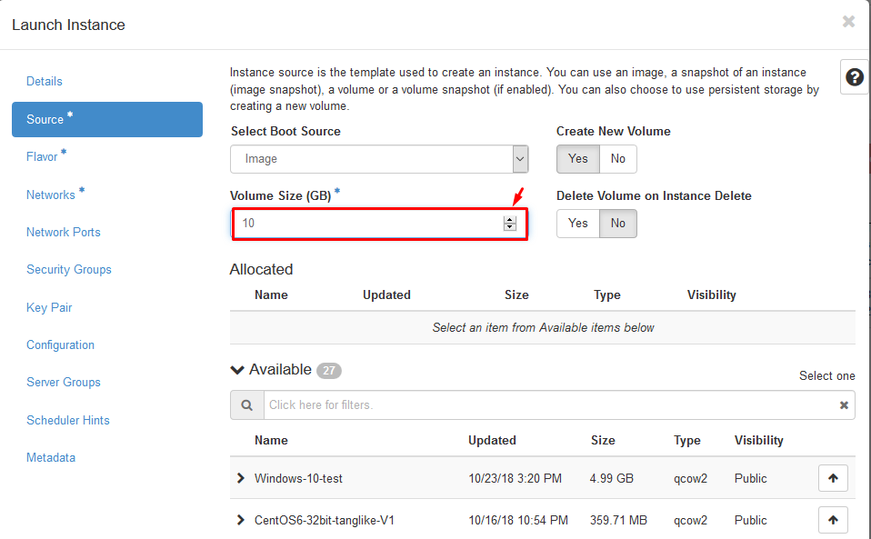
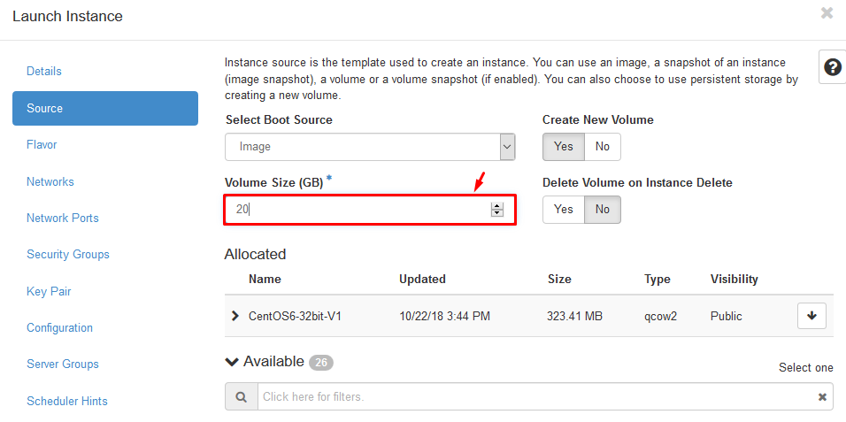
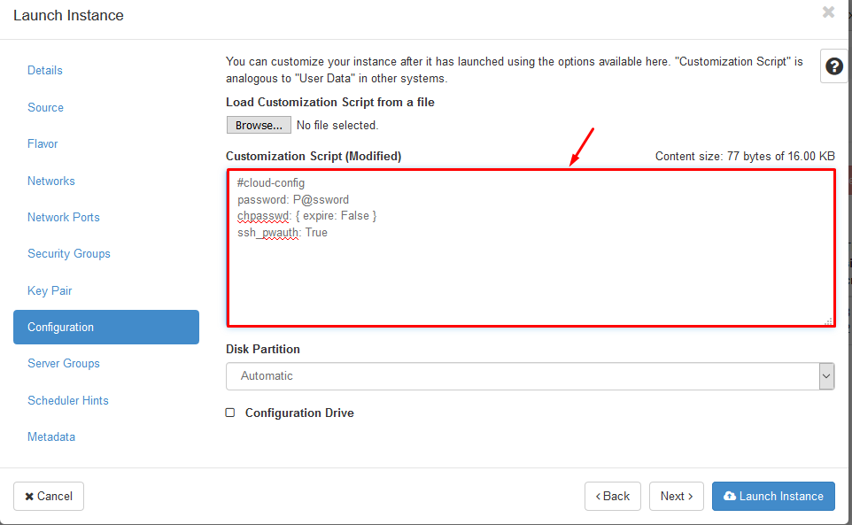
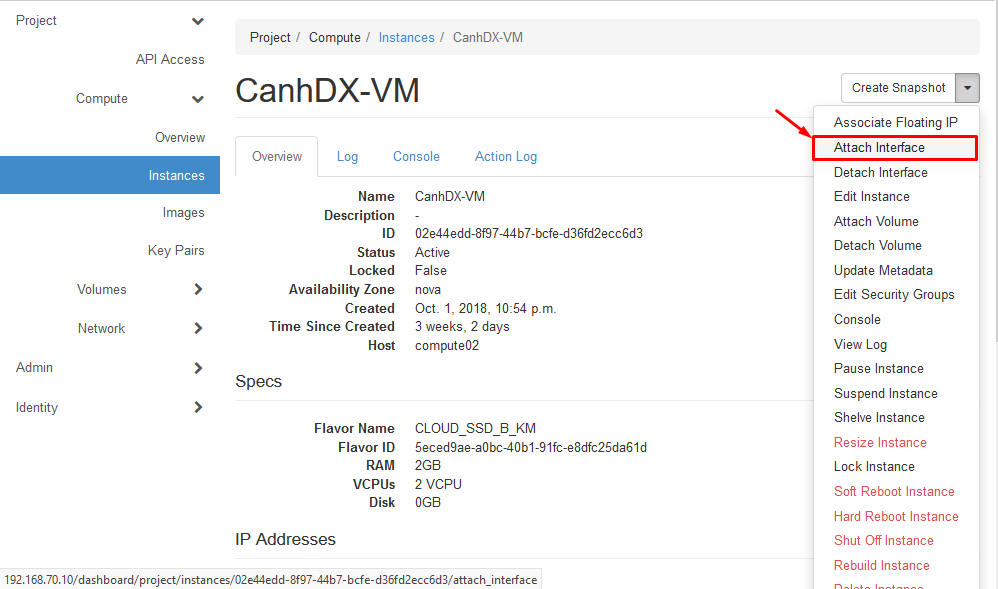
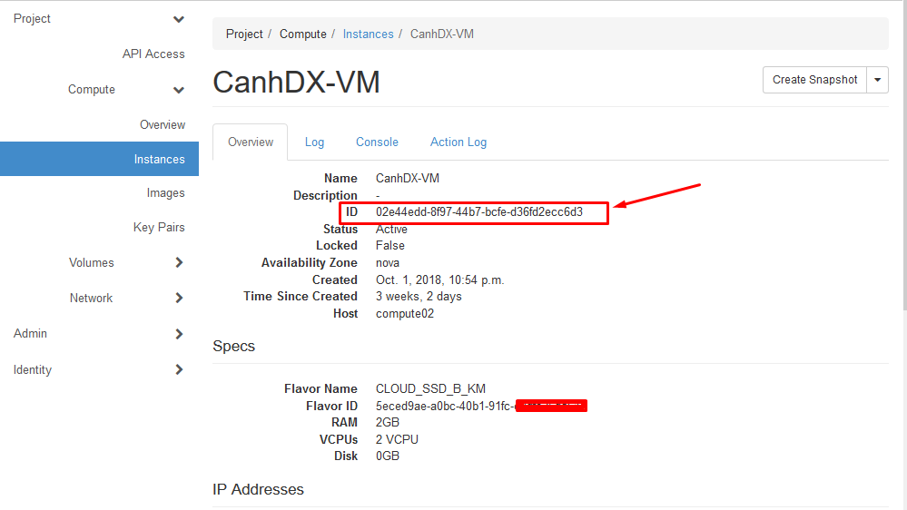
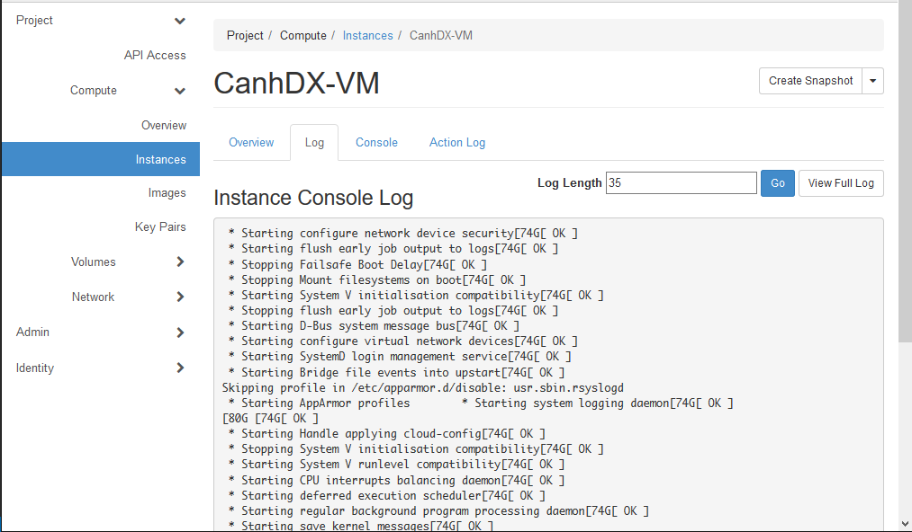

# Các bước kiểm tra Images cơ bản sau khi đóng Template

Chúng ta sẽ tạo VM từ Images này và kiểm tra 

## B1: Kiểm tra có thể tạo dung lượng min_size bao nhiêu (Dung lượng này = dung lượng file `qcow2` chúng ta tạo lúc đóng Images)

Tạo VM với dung lượng Volume = min_size (Ở đây linux là 10GB, windows trắng là 25GB,...) xem có tạo được không 



## B2: Kiểm tra khả năng tự động Extend của Volume 

Tạo VM với dung lượng lớn hơn min_size, sau khi tạo VM thì tiến hành login vào VM kiểm tra xem VM có nhận đủ dung lượng root disk không 



## B3: Kiểm tra truyền password qua cloud-init 

Truyền cloud-init khi create VM, Login thử bằng password truyền vào xem có login được không 



## B4: Add thêm IP xem có nhận không 



## B5: Thử tính năng reset password qua nova

Để VM running và login vào Controller node sử dụng `nova set-password <VM_ID>` để set password cho VM xem có nhận password mới không 

Lấy ID của VM 


Set paswd mới cho VM 


## B6: Kiểm tra xem tab log của VM 

Trong quá trình boot VM tiến hành truy cập tab `log` xem có log MV hiển thị không 



## B7: Kiểm tra app của VM 

Bước này chúng ta kiểm tra hoạt động của các app trên VM sau khi running như DA, Plesk, WHM

# Đổi thông tin DA sau khi tạo VM từ Template

- Login vào VM 
```sh 
ssh root@<VM_IP>
```

- Check IP Public server 
```sh 
ip a
```

- Chạy script change IP 
```sh 
cd /usr/local/directadmin/scripts
./ipswap.sh 192.168.122.36 <ip-public-server>
```

- Reboot
```sh 
init 6 
```

- Kiểm tra thông tin và đăng nhập 
```sh 
cat /usr/local/directadmin/scripts/*.txt
```

- Truy cập Dashboard DA kiểm tra 
http://<ip-public-server>:2222

# Đổi thông tin IP WHM sau khi tạo VM từ Template

CentOS6
``` sh
# Update license Cpanel
/usr/local/cpanel/cpkeyclt

# CentOS6
192.168.122.109
# Replace IP
Example: 
replace 123.30.145.16 103.28.36.104 -- /var/cpanel/mainip 
replace 123.30.145.16 103.28.36.104 -- /etc/hosts
replace 123.30.145.16 103.28.36.104 -- /etc/wwwacct.conf
replace 123.30.145.16 103.28.36.104 -- /usr/local/apache/conf/httpd.conf

IP=$(ip a | grep 255 | awk '{print $2}' | cut -d '/' -f1)

<VirtualHost 192.168.122.109:443 127.0.0.1:443 *:443> /usr/local/apache/conf/httpd.conf
ADDR 192.168.122.109 /etc/wwwacct.conf
192.168.122.109		cpanel.localhost.localdomain cpanel /etc/hosts
192.168.122.109 /var/cpanel/mainip
# Restart Services
service named restart
service httpd restart
```

CentOS7 
```sh
<VirtualHost 192.168.122.109:443 127.0.0.1:443 *:443> /usr/local/apache/conf/httpd.conf
ADDR 192.168.122.39 /etc/wwwacct.conf
192.168.122.39		cpanel.localhost.localdomain cpanel /etc/hosts
192.168.122.39 /var/cpanel/mainip


# Restart Services
systemctl restart named
systemctl restart httpd
# Reboot server
init 6 

# Edit hostname if not match
File /etc/wwwacct.conf
Example:
HOST share62-r3.nhanhoa.com
# Reboot server
```

Truy cập 
- WHM: https://<ip-public-server>:2083
- Cpanel: https://<ip-public-server>:2087
- Mail: https://<ip-public-server>:2095

# Đổi thông tin IP Plesk sau khi tạo VM từ Template

Đổi thông tin IP Plesk


Đổi thông tin password của MSSQL


Đổi thông tin password đăng nhập Plesk

```
https://support.plesk.com/hc/en-us/articles/115001761193-How-to-change-the-IP-address-of-Plesk-server-

https://docs.plesk.com/en-US/12.5/advanced-administration-guide-win/system-maintenance/changing-ip-addresses.49727/
```

Truy cập 
- Plesk: https://<ip-public-server>:2083

